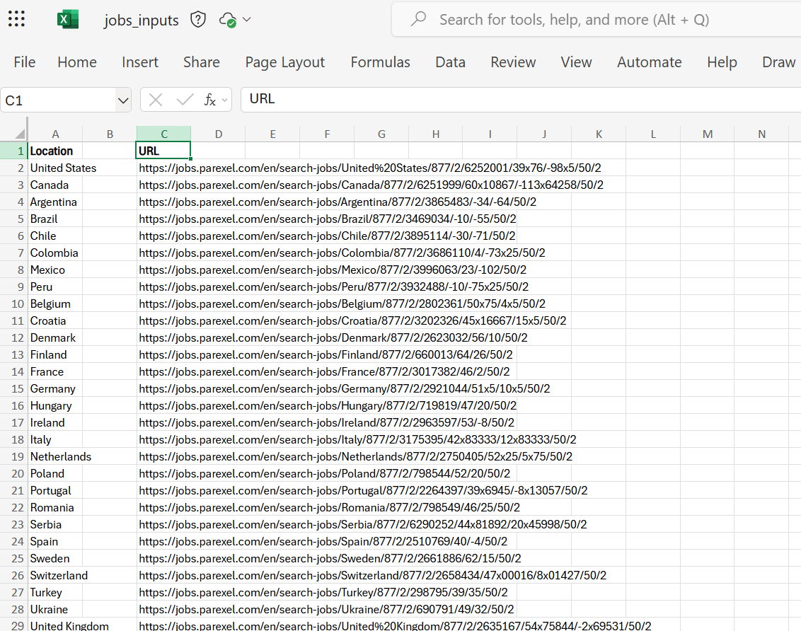
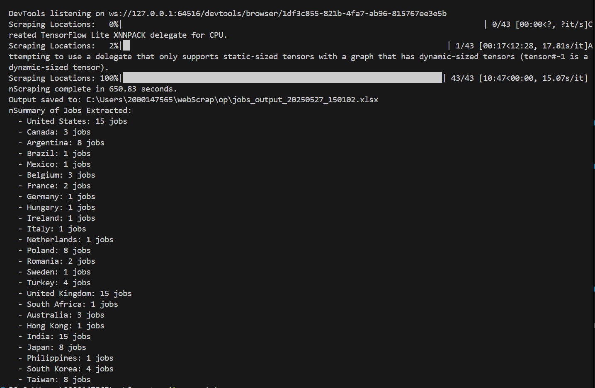
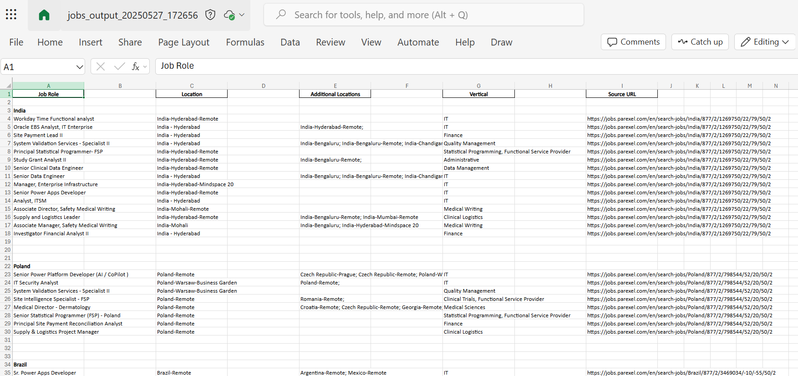

# px-job-extract

This python script is designed to automate the extraction of job descriptions from a list of URLs provided in an input Excel file. The tool navigates through job listing pages, collects relevant job details, and saves the extracted data into a well-formatted output Excel file.
---

## How It Works

1. **Input Preparation**:  
   The tool reads an input Excel file (`jobs_input.xlsx`) containing a list of locations and their corresponding job listing URLs.

2. **Data Extraction**:  
   Using Selenium and BeautifulSoup, the tool visits each URL, loads all job listings on the page, and extracts key details such as job role, location, additional locations, and vertical (department).

3. **Output Generation**:  
   The extracted data is saved into an output Excel file with a timestamped filename. The output file is formatted for better readability, including bold headers, blank rows for spacing, and adjusted column widths.

4. **Execution Summary**:  
   Once the scraping process is complete, a summary of the jobs extracted for each location is displayed in the terminal.

---

## Snippets

### Ip Excel File
  
The input file contains two columns: `Location` and `URL`. Each row represents a location and its corresponding job listing URL to be scraped.

---

### Terminal After Execution
  
The terminal displays the progress of the scraping process and a summary of the jobs extracted for each location.

---

### Op Excel File
  
The output file contains the extracted job details, organized and formatted for easy readability. It includes columns for job role, location, additional locations, vertical, and source URL.

---

## Getting Started

### Prerequisites
- Python 3.x
- Required Python libraries: `selenium`, `beautifulsoup4`, `pandas`, `openpyxl`, `tqdm`
- Google Chrome browser and the corresponding ChromeDriver

